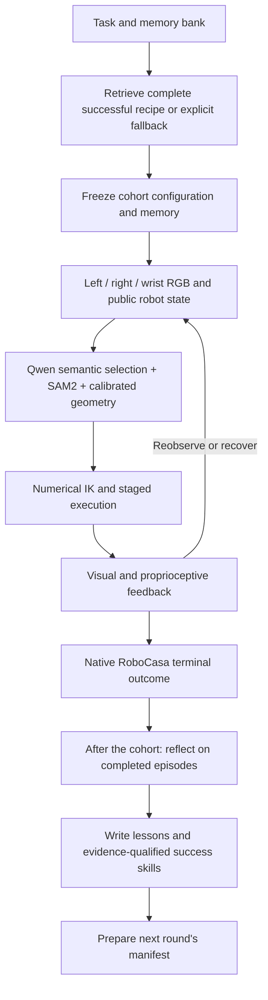

# Qwen RoboCasa Harness

A task-routed manipulation harness that combines a frozen Qwen vision-language model, RGB geometry, numerical robot control, and outcome-grounded experience memory.

The latest completed evaluation achieved **5 successes out of 10 tasks (50%)**, compared with **2/10 (20%)** in the earlier ten-task baseline. Both use the original seed-7 pick-and-place scenes and a budget of 900 simulator actions per task. The latest cohort took **20.0 minutes**, used **6,196 simulator actions**, and made **132 Qwen calls**.

**[Evaluation report](reports/EVALUATION.md) · [Watch all ten recordings](https://github.com/gimai-dev/qwen-robocasa-harness/blob/main/videos/README.md) · [Raw results](results/fullten-r1/summary.json) · [Video files](videos/)**

## What this project does

The project investigates how to make a Qwen-driven robot workflow more reliable in RoboCasa without updating model weights. Qwen handles semantic and visual decisions; geometry and numerical control turn those decisions into bounded robot movements. The workflow stores both successful strategies and failure lessons across episodes.

The current implementation is a **portfolio of task-specific executable recipes**. A recipe includes the controller snapshot, entry point, complete argument list, and original memory input. Each episode still locates objects from its current observations. Recipes are not recorded joint trajectories.

This repository contains the ten controller snapshots actually used in the reported cohort, a separately reviewed successor for Sink-to-Counter, the workflow, shared runtime support, original result JSON, experience memory, and all ten original video files.

## Architecture



### Model and perception

- **Model:** Qwen3.8-27B, BF16, frozen weights, served through the existing local endpoint on port 8002.
- **Views:** left, right, and wrist RGB images.
- **Perception:** Qwen selects semantic targets and visual candidates; SAM2 provides masks; calibrated multi-view geometry estimates grasp and destination locations. Some routes use visible landmarks such as a sink drain or plate boundary.
- **State:** public joint positions, end-effector pose, gripper opening, and force/telemetry support execution. Runtime policy inputs exclude simulator object ground-truth poses and depth.
- **Context:** current views and selected recent visual evidence are supplied to Qwen. Full pose logs and all historical images stay on disk. Retained legacy recipes and newer routes have different image formatting and history policies; there is no uniform three-image rule across all ten snapshots.

### Execution and recovery

The main manipulation sequence is approach, descend, close, lift and verify, transport, lower and release, and withdraw. Numerical IK and waypoint execution handle motion. Tracking, gripper opening, force, and visual feedback identify empty grasps, blocked contact paths, and lost objects. Recovery may retreat, change viewpoint, re-ground, or retry, depending on the selected controller.

The successful Sink-to-Counter update uses a shallower grasp to avoid palm-first contact, raises the object above the receiver before lateral transport, and retains a previously grounded stationary plate in world coordinates across measured base motion. The reviewed successor also checks for loss of the object during the new receiver-raise and base-motion stages.

### Cross-episode skills and memory

The saved bank contains **5 successful skill cards and 111 lessons**. The lesson ledger includes previously recorded experience, 87 development episodes, and the final ten-task cohort. Successful episodes can also have reflection entries in that ledger.

1. A known successful task restores its complete reproduced recipe, including its original memory input.
2. An experimental fallback receives skill cards and at most the **four most recent lessons for the same task**, ordered by completion time.
3. After a cohort completes, Qwen reflects on each completed episode using its official outcome, executed events, stop reason, and final images.
4. Failures produce lessons. Successes need evidence of controlled release and withdrawal before entering the success-skill bank.
5. A complete executable recipe is attached only for a registered reproduced route.

**Memory is frozen during evaluation.** Reflection and writeback happen after the whole cohort and influence the next round. This is experience retrieval and controller selection, not model training or demonstrated online learning within the reported cohort.

## Evaluation results

All names below are RoboCasa task identifiers with the common `PickPlace` prefix omitted for readability.

| Task | Official outcome | Actions | Qwen calls |
|---|---|---:|---:|
| CounterToDrawer | Success | 745 | 4 |
| CounterToStandMixer | Success | 873 | 10 |
| CounterToSink | Success | 398 | 12 |
| StoveToCounter | Success | 775 | 12 |
| SinkToCounter | Success | 642 | 12 |
| DrawerToCounter | Failure | 458 | 5 |
| CabinetToCounter | Failure | 336 | 9 |
| CounterToCabinet | Failure | 698 | 30 |
| CounterToMicrowave | Failure | 423 | 18 |
| MicrowaveToCounter | Failure | 848 | 20 |

Success is taken from `result.json → terminal_outcome.success`. A Qwen judgment that an object is held, or a controller reaching its final stage, does not establish success. All ten tasks remain in the denominator. The [report](reports/EVALUATION.md) explains each success, each failure, and the development attempts made after the fifth success.

## Repository layout

```text
controllers/
  cohort/<Task>/        Exact per-task controller source from the reported cohort
  reviewed/SinkToCounter/  Independently rerun successor; separate from cohort
workflow/              Evaluator, episode entry, reflection, retrieval, orchestration
runtime/robocasa_inspect/ Shared model/simulator support source
memory/                Original frozen input and final learned bank
results/fullten-r1/     Original per-task result, evidence, reflection, and launch data
results/experiments.json  Development ledger: 87 episodes and 4 probes
environment/           Observed versions, upstream revisions, local RoboCasa patch
reports/               English evaluation and reproduction documentation
videos/                Ten original H.264 MP4 observation recordings
docs/                  Optional HTML video gallery source
tools/prepare_checkout.py  Materialize recipe paths for a checkout on the existing host
```

The shared runtime contains historical support modules as well as the active model and simulator interfaces. Their presence does not mean every module is used by the ten-task portfolio.

## Reproduction

### Inspect results and videos on any computer

```sh
git clone https://github.com/gimai-dev/qwen-robocasa-harness.git
cd qwen-robocasa-harness
python3 -m json.tool results/fullten-r1/summary.json
```

No GPU, model download, or simulator installation is needed to inspect the saved results. Videos can be played through the public video index or downloaded from `videos/`.

### Run on the existing experiment host

The preserved simulator launcher is tied to the existing Linux host environment. Its requirements include Python 3.11, the RoboCasa/robosuite checkout and assets, the recorded local XML patch, the SAM2 environment and checkpoint, NVIDIA EGL, and the existing Qwen model service and local credential/configuration files. See [Reproduction](reports/REPRODUCTION.md) for paths, versions, and migration requirements.

On that host, from a fresh checkout:

```sh
python3 tools/prepare_checkout.py --output /home/jli/work/qwen-harness-release-config

# Re-evaluate the exact frozen ten-task portfolio.
/home/jli/work/robocasa-inspect-official/.venv/bin/python \
  /home/jli/work/qwen-harness-release-config/evaluate.py \
  --manifest /home/jli/work/qwen-harness-release-config/fullten-r1.json \
  --output /home/jli/state/qwen-release-evaluation
```

For a new round that retrieves skills, evaluates, reflects, and prepares the following round:

```sh
/home/jli/work/robocasa-inspect-official/.venv/bin/python \
  /home/jli/work/qwen-harness-release-config/run_workflow.py \
  --memory /home/jli/work/qwen-harness-release-config/learned-memory-final.json \
  --fallback-manifest /home/jli/work/qwen-harness-release-config/fullten-r1.json \
  --output /home/jli/state/qwen-release-next-round
```

Each output directory must be new. The first command uses the exact cohort snapshots and restored memory. The second uses the learned bank, retrieves the reviewed Sink-to-Counter recipe, and changes fallback contexts; it is a **new experiment**, not the already reported cohort. A ten-task run previously took about 20 minutes; model load and failures can change that time, and reflection adds further work.

### Main workflow entry points

| Script | Purpose |
|---|---|
| `evaluate.py` | Run one fresh episode per manifest task; retain outcomes and compute completed-cohort SR |
| `episode.py` | Launch a modern controller with a fixed memory input |
| `plan_from_memory.py` | Restore complete recipes or retrieve recent same-task lessons |
| `learn_completed.py` | Reflect on completed native episodes and update the experience bank |
| `run_workflow.py` | Compose retrieval, evaluation, learning, and next-round preparation |
| `validated-routes.json` | Register the five reproduced recipes |
| `fullten-r1.json` | Preserve the ten routes used for the published cohort |

## Recordings

The videos show the **entire saved observation sequence** for each reported episode, with left, right, and wrist images arranged horizontally. They are native harness recordings encoded at **4 frames per second**, not continuous real-time recordings of every simulator step. Their 5–15 second durations do not represent episode wall time. Success and failure recordings are both included, without replacing failed runs with better development attempts.

## Limitations

- The 50% result is a development-selected, fixed-seed task portfolio. It is not an unseen-seed or unseen-task generalization estimate.
- Repeated development on the same scenes informed recipe selection. The completed cohort gives one fresh episode per task; it is not an independent held-out benchmark.
- Different tasks use different controller snapshots. A single general controller matching this SR has not been demonstrated.
- Development used offline simulator contacts and object geometry for diagnosis. Those diagnostic inputs are distinct from runtime RGB and public robot-state inputs.
- The harness base-action cap changed from 0.25 to 0.5, within the official normalized range. The improvement is not attributable solely to prompting or memory.
- External assets, model weights, server credentials/configuration, NVIDIA driver files, and complete raw frame directories are not distributed. The launcher retains host-specific paths, user IDs, and Linux namespace requirements. Fresh-machine installation and portability are not validated.
- Publication adds documentation, a gallery, and path preparation. It does not constitute another ten-task native evaluation.

## Upstream projects and provenance

The simulator checkouts used were [RoboCasa](https://github.com/robocasa/robocasa) at `a07e365c958c4216cd6bbd5f30b47f09a65c6f00` and [robosuite](https://github.com/ARISE-Initiative/robosuite) at `5ce6643f3092639d08f7b0f90ed1c6a84f50552c`. Segmentation used [SAM2](https://github.com/facebookresearch/sam2) at `2b90b9f5ceec907a1c18123530e92e794ad901a4`, with the SAM2.1 Hiera Small checkpoint. Qwen is the frozen language-and-vision model used by the experiment service. Upstream source, models, and assets retain their respective licenses. See [environment notes](reports/REPRODUCTION.md) for the observed setup and source patch.
