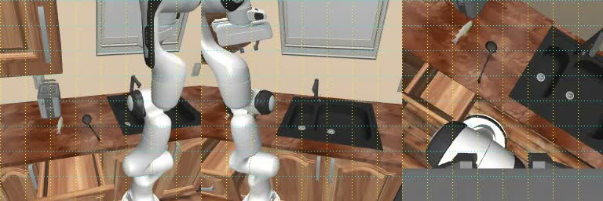
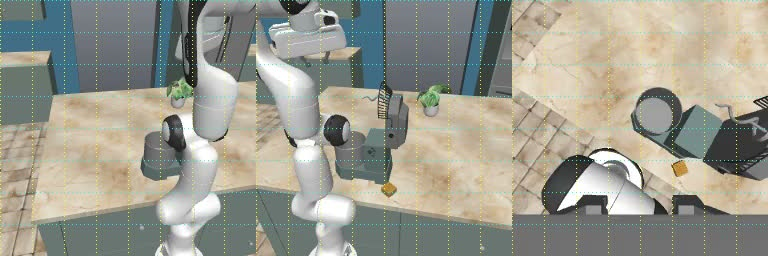
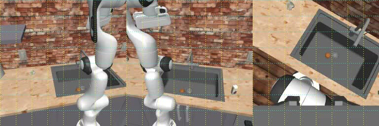
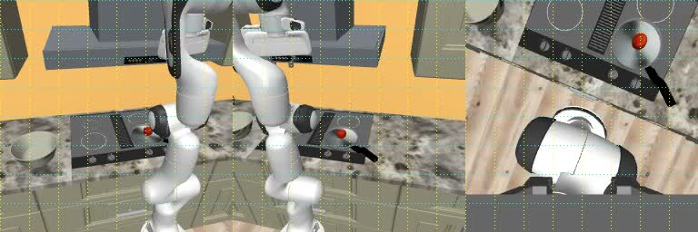
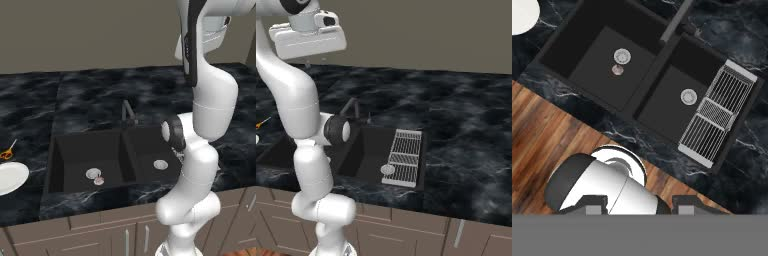
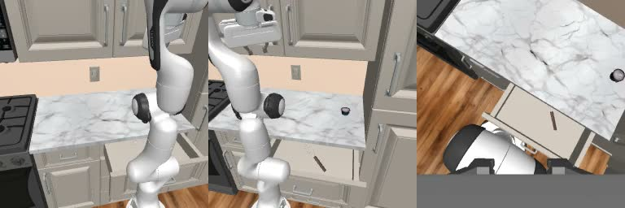
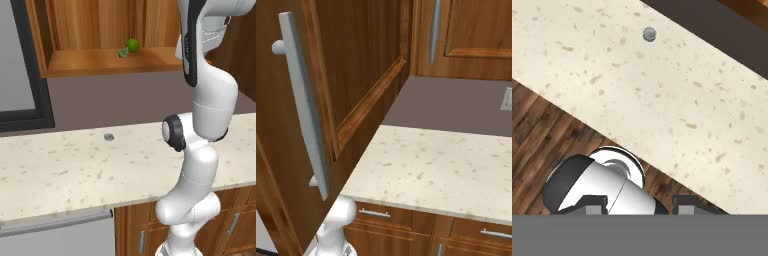
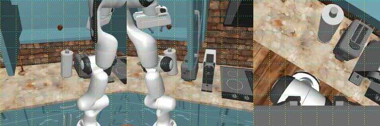
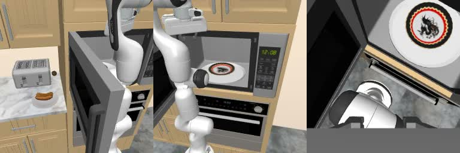
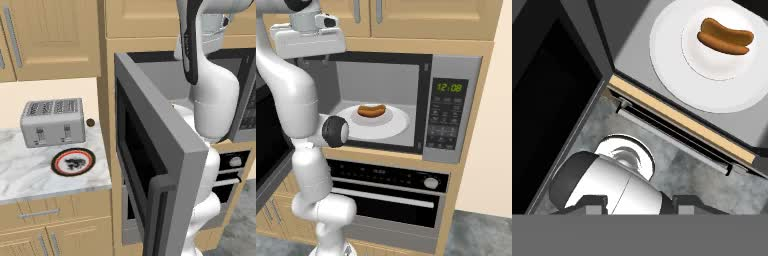

# Evaluation recordings

All ten original recordings from the completed cohort: **five official successes and five failures**. Everything on this page is public and can be shared without repository membership.

[Project README](../README.md) · [Full evaluation report](../reports/EVALUATION.md) · [Native summary](../results/fullten-r1/summary.json)

Each recording shows all saved left, right, and wrist observations arranged horizontally at 4 fps. These are observation sequences, not continuous real-time recordings of every simulator step. Clip duration is not episode runtime. The original MP4 bytes are unchanged; filenames were simplified for sharing.

Use **Play / download MP4** for a direct recording link, or share a task section using its heading link.

## CounterToDrawer

**Success** · 745 actions · 4 Qwen calls

[Play / download MP4](https://raw.githubusercontent.com/gimai-dev/qwen-robocasa-harness/main/videos/PickPlaceCounterToDrawer.mp4) · [GitHub video page](PickPlaceCounterToDrawer.mp4) · [Native result](../results/fullten-r1/PickPlaceCounterToDrawer/result.json)

Stop reason: pick and place sequence finished; evaluate official outcome.

## CounterToStandMixer

**Success** · 873 actions · 10 Qwen calls

[Play / download MP4](https://raw.githubusercontent.com/gimai-dev/qwen-robocasa-harness/main/videos/PickPlaceCounterToStandMixer.mp4) · [GitHub video page](PickPlaceCounterToStandMixer.mp4) · [Native result](../results/fullten-r1/PickPlaceCounterToStandMixer/result.json)

Stop reason: pick and place sequence finished; evaluate official outcome.

## CounterToSink

**Success** · 398 actions · 12 Qwen calls

[Play / download MP4](https://raw.githubusercontent.com/gimai-dev/qwen-robocasa-harness/main/videos/PickPlaceCounterToSink.mp4) · [GitHub video page](PickPlaceCounterToSink.mp4) · [Native result](../results/fullten-r1/PickPlaceCounterToSink/result.json)

Stop reason: pick and place sequence finished; evaluate official outcome.

## StoveToCounter

**Success** · 775 actions · 12 Qwen calls

[Play / download MP4](https://raw.githubusercontent.com/gimai-dev/qwen-robocasa-harness/main/videos/PickPlaceStoveToCounter.mp4) · [GitHub video page](PickPlaceStoveToCounter.mp4) · [Native result](../results/fullten-r1/PickPlaceStoveToCounter/result.json)

Stop reason: pick and place sequence finished; evaluate official outcome.

## SinkToCounter

**Success** · 642 actions · 12 Qwen calls

[Play / download MP4](https://raw.githubusercontent.com/gimai-dev/qwen-robocasa-harness/main/videos/PickPlaceSinkToCounter.mp4) · [GitHub video page](PickPlaceSinkToCounter.mp4) · [Native result](../results/fullten-r1/PickPlaceSinkToCounter/result.json)

Stop reason: pick and place sequence finished; evaluate official outcome.

## DrawerToCounter

**Failure** · 458 actions · 5 Qwen calls

[Play / download MP4](https://raw.githubusercontent.com/gimai-dev/qwen-robocasa-harness/main/videos/PickPlaceDrawerToCounter.mp4) · [GitHub video page](PickPlaceDrawerToCounter.mp4) · [Native result](../results/fullten-r1/PickPlaceDrawerToCounter/result.json)

Stop reason: task source not held after lift.

## CabinetToCounter

**Failure** · 336 actions · 9 Qwen calls

[Play / download MP4](https://raw.githubusercontent.com/gimai-dev/qwen-robocasa-harness/main/videos/PickPlaceCabinetToCounter.mp4) · [GitHub video page](PickPlaceCabinetToCounter.mp4) · [Native result](../results/fullten-r1/PickPlaceCabinetToCounter/result.json)

Stop reason: contact blocked; reversing executed waypoints.

## CounterToCabinet

**Failure** · 698 actions · 30 Qwen calls

[Play / download MP4](https://raw.githubusercontent.com/gimai-dev/qwen-robocasa-harness/main/videos/PickPlaceCounterToCabinet.mp4) · [GitHub video page](PickPlaceCounterToCabinet.mp4) · [Native result](../results/fullten-r1/PickPlaceCounterToCabinet/result.json)

Stop reason: receiver unresolved after lateral views.

## CounterToMicrowave

**Failure** · 423 actions · 18 Qwen calls

[Play / download MP4](https://raw.githubusercontent.com/gimai-dev/qwen-robocasa-harness/main/videos/PickPlaceCounterToMicrowave.mp4) · [GitHub video page](PickPlaceCounterToMicrowave.mp4) · [Native result](../results/fullten-r1/PickPlaceCounterToMicrowave/result.json)

Stop reason: RGB grounding unresolved after base and wrist views.

## MicrowaveToCounter

**Failure** · 848 actions · 20 Qwen calls

[Play / download MP4](https://raw.githubusercontent.com/gimai-dev/qwen-robocasa-harness/main/videos/PickPlaceMicrowaveToCounter.mp4) · [GitHub video page](PickPlaceMicrowaveToCounter.mp4) · [Native result](../results/fullten-r1/PickPlaceMicrowaveToCounter/result.json)

Stop reason: unreachable_front_withdraw.
